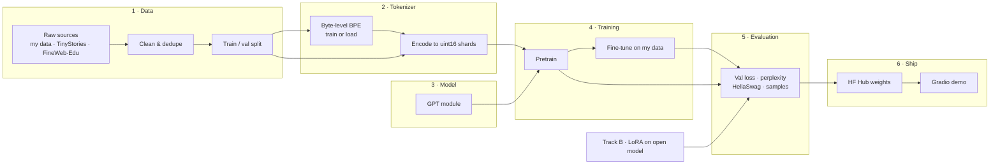
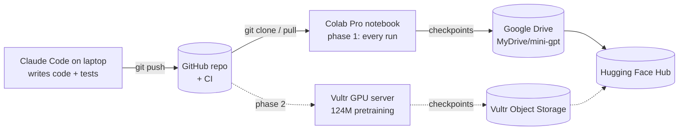

# Train Your Own GPT: System Design

Status: draft v2 · 2026-09-27 · phase 1 (Colab) in progress

## 1. Goal

Build a GPT-style language model from scratch in PyTorch, train it, fine-tune it on custom data, and ship it as a public demo. Every core part (tokenizer, model, training loop, fine-tuning) is written by hand. Library code is used only for plumbing (downloading datasets, logging, the demo UI) and as a reference to test against.

**Success criteria**

1. A 124M-parameter model pretrained on at least 2.5B tokens, with a falling validation loss curve and coherent generated text.
2. The same model fine-tuned on custom data, with better validation loss on that data than the base model.
3. A measured comparison against a LoRA-tuned open model (Track B) on the same eval set.
4. A public GitHub repo with tests, a Hugging Face model card, and a Gradio demo anyone can try.
5. Total cloud spend within the $250 Vultr credit.

**Out of scope for v1:** RLHF/DPO, multi-node training, mixture-of-experts, quantization, serving at scale.

### Phases

| Phase | Where | What | Done when |
|---|---|---|---|
| **1 · Prove the pipeline** | **Colab Pro only** | Build everything from scratch; pretrain the **14M** model on TinyStories; fine-tune it on **one chapter of the Bhagavad Gita** | Before/after fine-tuning results in `docs/results.md`, demo runs in Colab |
| **2 · Scale up** | Vultr (+ Colab Pro for light jobs) | Pretrain the **124M** model on FineWeb-Edu; fine-tune on the Gita; Track B comparison; public demo | Success criteria 1–5 above are met |

Phase 2 starts only after phase 1 works end to end. The same code and configs run in both phases.

## 2. Constraints

| Constraint | Value | Design consequence |
|---|---|---|
| Local machine | Windows laptop, CPU only | Used for editing code and git only in phase 1. Tests stay CPU-only so CI can run them. |
| Phase 1 GPU | **Google Colab Pro**: T4 (16 GB, fp16 only, measured 22–25 TFLOPS fp16), L4 (24 GB, bf16), A100 when available | Every run happens here in phase 1. Training must checkpoint often and resume exactly. |
| Phase 2 GPU | Vultr, $250 credit | One script for all environments; budget guard that stops the run automatically. |
| How Colab is driven | Colab notebook in the browser, connected to Claude Code through the Colab MCP connection | Colab does not see local files: code reaches Colab through GitHub, data through Drive or a download. |

## 3. Architecture overview



Every stage reads files from the previous stage and writes files for the next. No stage calls another stage's internals. This keeps each stage testable alone and lets different stages run on different machines.

## 4. Repository layout

```
Train-Your-Own-GPT/
├── pyproject.toml            # package "tygpt", pip install -e .
├── configs/                  # YAML configs, one per experiment
│   ├── tiny_cpu.yaml         # ~2M params, tests and smoke runs
│   ├── colab.yaml            # Drive paths for Colab runs
│   ├── small_tinystories.yaml# ~14M params, phase 1 pretraining
│   ├── gita_chapter.yaml     # phase 1 fine-tuning on a Gita chapter
│   └── base124m_fineweb.yaml # 124M params, phase 2 on Vultr
├── datasets/gita/            # chapter text + SOURCE.md (translation, licence)
├── src/tygpt/
│   ├── config.py             # typed config dataclasses + YAML loading
│   ├── data/
│   │   ├── sources.py        # adapters: text files, JSONL, HF datasets
│   │   ├── clean.py          # normalisation, filtering, exact dedupe
│   │   └── prepare.py        # CLI: raw → cleaned → tokenized shards
│   ├── tokenizer/
│   │   ├── bpe.py            # byte-level BPE (train, encode, decode, save, load)
│   │   └── backends.py       # common interface: ScratchBPE | TiktokenGPT2
│   ├── model/
│   │   ├── gpt.py            # GPT, Block, CausalSelfAttention, MLP
│   │   └── generate.py       # sampling: temperature, top-k, top-p
│   ├── train/
│   │   ├── loader.py         # memmap token loader, SFT batch loader
│   │   ├── trainer.py        # training loop
│   │   ├── checkpoint.py     # save / resume
│   │   └── logging.py        # stdout, CSV, optional W&B
│   ├── eval/
│   │   ├── perplexity.py
│   │   ├── hellaswag.py
│   │   └── compare.py        # side-by-side report: scratch vs Track B
│   └── cli.py                # tygpt prepare | train | sample | eval
├── track_b/                  # LoRA fine-tune of an open model (HF + PEFT/Unsloth)
├── notebooks/
│   └── colab_runner.ipynb    # phase 1 runner: GPU check, Drive, clone, install, test, run
├── scripts/                  # vultr_setup.sh, vultr_teardown.md checklist
├── demo/app.py               # Gradio app
├── tests/                    # pytest, runs on CPU
└── docs/
    ├── system-design.md      # this file
    └── results.md            # loss curves, tables, cost report
```

## 5. Components

Each component lists its job, its inputs and outputs, and the decisions that shape it.

### 5.1 Config

- **Job:** one typed source of truth for every run. No hard-coded hyperparameters anywhere else.
- **Shape:** Python dataclasses (`DataConfig`, `TokenizerConfig`, `ModelConfig`, `TrainConfig`, `PathsConfig`) loaded from YAML. Any field can be overridden on the command line: `tygpt train configs/small.yaml train.lr=3e-4`.
- **Why:** the same config file is saved inside every checkpoint, so any result can be reproduced exactly.

### 5.2 Data pipeline

- **Job:** turn raw sources into clean, split text.
- **Input:** a source spec in config, such as `type: text_dir`, `type: jsonl`, or `type: hf_dataset`.
- **Output:** `data/processed/<name>/{train,val}.jsonl` (one document per line, so documents may contain newlines) plus `data_card.json` (document counts, bytes, filters applied, source hashes).
- **Steps:**
  1. **Load** through a source adapter. Each adapter yields plain documents. This is where your own data plugs in.
  2. **Clean:** Unicode NFC normalisation, strip control characters, drop documents that are too short or mostly non-text.
  3. **Deduplicate:** exact dedupe by SHA-256 of normalised text. Near-duplicate detection (MinHash) is deferred until real data shows a need.
  4. **Split** by document, not by line, with a fixed seed. Default is 99/1, and at least 1,000 val documents when available.
- **Big datasets:** FineWeb-Edu is streamed from Hugging Face and never fully held in memory.

### 5.3 Tokenizer

- **Job:** convert text to token IDs and back.
- **Interface** (both backends implement it):
  ```python
  class Tokenizer(Protocol):
      vocab_size: int
      def encode(self, text: str) -> list[int]: ...
      def decode(self, ids: list[int]) -> str: ...
      special_tokens: dict[str, int]   # <|endoftext|>, <|user|>, <|assistant|>, <|end|>
  ```
- **Backends:**
  - `ScratchBPE`: byte-level BPE written from scratch, with GPT-2-style regex pre-splitting. Trained on a sample of up to about 100 MB. Used for TinyStories and custom-data experiments. Default vocabulary is 8,192.
  - `TiktokenGPT2`: the GPT-2 vocabulary (50,257 tokens) through `tiktoken`. Used for the 124M FineWeb run, because encoding billions of tokens with a pure-Python encoder is too slow.
- **Proof that the scratch version is correct:** load GPT-2's published merges into `ScratchBPE` and check that its output matches `tiktoken` exactly on a test corpus. This test also shows interviewers that the scratch implementation is right, not just written.
- **Encoded format:** flat `uint16` NumPy arrays (`train.bin`, `val.bin`), with documents separated by `<|endoftext|>`. A sidecar `meta.json` records the tokenizer name, vocab size and token count. `uint16` works because both vocabularies are under 65,536.

### 5.4 Model

- **Job:** a decoder-only transformer, GPT-2 architecture.
- **Structure:** token embedding + learned position embedding → N × Block (pre-LayerNorm → causal multi-head self-attention → residual → pre-LayerNorm → MLP 4× with GELU → residual) → final LayerNorm → LM head with weights tied to the token embedding.
- **Attention:** uses `torch.nn.functional.scaled_dot_product_attention(is_causal=True)`, which picks flash attention on supported GPUs. A manual implementation is kept too, and a test checks that both give the same output.
- **Initialisation:** normal(0, 0.02), with residual projections scaled by 1/√(2·n_layer) as in GPT-2.
- **Presets:**

| Preset | Layers | Heads | d_model | Context | Vocab | ~Params | Runs on |
|---|---|---|---|---|---|---|---|
| `tiny` | 4 | 4 | 128 | 256 | 8,192 | 2M | Tests, quick smoke runs |
| `small` | 6 | 6 | 384 | 512 | 8,192 | 14M | Colab Pro (phase 1) |
| `base124m` | 12 | 12 | 768 | 1,024 | 50,304* | 124M | Vultr A100/H100 |

\*50,257 padded to a multiple of 64 for GPU efficiency.

### 5.5 Training

- **Job:** one trainer for pretraining and fine-tuning, on any device.
- **Loop features:**
  - AdamW (β = 0.9, 0.95; weight decay 0.1 on 2-D weights only)
  - Linear warmup then cosine decay to 10% of the peak learning rate
  - Gradient clipping at 1.0
  - Gradient accumulation, so the effective batch size doesn't depend on GPU memory
  - Mixed precision: bf16 on A100/H100, fp16 with GradScaler on T4, fp32 on CPU
  - `torch.compile` on when the environment supports it
  - Evaluation every `eval_interval` steps on a fixed val subset
- **Device selection:** automatic (`cuda` → `mps` → `cpu`), with the precision chosen to match.
- **Scale:** single GPU for v1. Multi-GPU DDP is a later extension. The trainer is written so it can be added without restructuring.

### 5.6 Checkpointing and resume

- **Saved every `ckpt_interval` steps and on exit:** model weights, optimizer state, GradScaler state, step, config, RNG states, data-loader position, and the best val loss so far.
- **Two files are kept:** `last.pt`, which is overwritten, and `best.pt`, the lowest val loss. Writes are atomic (write to a temporary file, then rename), so a disconnect mid-write can't corrupt a checkpoint.
- **Resume:** `tygpt train <config> --resume` continues from `last.pt`. A test checks that "train 20 steps" and "train 10 steps, stop, resume, train 10 more" produce the same weights.

### 5.7 Fine-tuning (SFT)

The fine-tuning mode depends on your data type:

| Data type | Mode | How it works |
|---|---|---|
| Documents / plain text | **Continued pretraining** | Same loss as pretraining on the new text, with a lower learning rate. |
| Conversations / Q&A | **Supervised fine-tuning** | JSONL `{"messages":[{"role","content"},...]}` rendered with special tokens. Loss is computed only on assistant tokens (a mask sets user-token targets to -100). |

In both modes, training starts from the pretrained checkpoint, uses a learning rate about 10× lower, and runs a few epochs with early stopping on custom-data val loss, so the model doesn't just memorise the data.

### 5.8 Generation

- `generate(model, prompt_ids, max_new_tokens, temperature, top_k, top_p)`, stopping at `<|end|>` or `<|endoftext|>`.
- v1 recomputes the full context at every step. A KV cache is a later optimisation, and a test will check it gives the same output as the no-cache version.

### 5.9 Evaluation

| Metric | Applies to | Purpose |
|---|---|---|
| Val loss / perplexity | All runs | Main training signal |
| Fixed-prompt samples | All runs | Qualitative check, saved at every eval |
| HellaSwag accuracy | `base124m` | Standard benchmark. The GPT-2 124M reference is ~29.5% |
| Bits per byte | All runs | Loss normalised by bytes, so models with different tokenizers can be compared |
| Custom-data bits per byte | Scratch SFT vs Track B | The head-to-head comparison |

`compare.py` writes `docs/results.md` with tables and loss-curve PNGs.

### 5.10 Track B (LoRA baseline)

- Lives in `track_b/` and deliberately uses libraries: Hugging Face `transformers`, `peft` or Unsloth, and a 1B–3B open model (Qwen, Llama or Gemma).
- It uses the **same processed dataset and the same val split** as the scratch model (section 5.2), so the comparison is fair.
- It runs on Colab with QLoRA.

### 5.11 Demo

- `demo/app.py`: a Gradio chat or completion UI that loads weights from the Hugging Face Hub. It runs on a free HF Spaces CPU instance, where a 124M model is fast enough.
- Model card: architecture, data, training compute and cost, eval results, limitations.

## 6. Environments and workflow

The same code and configs run everywhere. Only `paths.*` and the device change.



| Environment | Phase | How code arrives | Data & checkpoint location | Used for |
|---|---|---|---|---|
| Laptop | 1, 2 | Local working copy | none | Writing code, git, CPU tests |
| **Colab Pro** | **1**, 2 | `notebooks/colab_runner.ipynb`: `git clone`/`pull` + `pip install -e .` | Drive `MyDrive/mini-gpt/`; shards copied to local `/content` for speed | Tests, data prep, tokenizer, 14M pretraining, fine-tuning, eval, demo |
| Vultr | 2 | `git clone` + setup script | Local NVMe, synced to object storage every checkpoint | 124M pretraining |

**Important:** Colab cannot see files on your laptop. Code gets there through GitHub, and data gets there through Drive or a download. The Colab notebook is only a runner: it can be rebuilt at any time, because everything that matters is in GitHub (code) or Drive (data and checkpoints).

## 7. Failure handling

| Failure | Detection | Response |
|---|---|---|
| Colab disconnect / timeout | Session ends | Resume from `last.pt` on Drive. At most `ckpt_interval` steps are lost. |
| Loss becomes NaN/Inf | Checked every step | Save a debug checkpoint, log the last batch index, stop with a clear error. |
| Loss spike | Loss > 3× running average | Log a warning. Stop if it persists for more than N evals. |
| CUDA out of memory | Exception on first steps | Error message suggests halving `micro_batch_size`; accumulation keeps the effective batch the same. |
| Vultr overspend | `train.max_hours` and `train.max_cost_usd` in config | Trainer saves and exits cleanly when either limit is reached. |
| Forgetting to destroy the Vultr instance | Human process | `scripts/vultr_teardown.md` checklist: sync checkpoints → verify → destroy. |
| Corrupt checkpoint | Atomic write (temp file + rename) | The previous checkpoint is always valid. |

## 8. Testing strategy

All tests run on CPU in under about 2 minutes, locally and in GitHub Actions on every push.

| Area | Tests |
|---|---|
| Tokenizer | encode→decode round trip on random Unicode; ScratchBPE with GPT-2 merges matches tiktoken exactly; special tokens never split |
| Data | dedupe removes exact duplicates; split has no document in both train and val; `uint16` shards round-trip |
| Model | output shapes; parameter count matches preset; **causality** (changing token t+1 never changes logits at ≤ t); SDPA and manual attention agree |
| Training | overfits a single batch to near-zero loss; save → resume gives the same weights as uninterrupted training; SFT mask gives zero loss contribution from user tokens |
| Generation | deterministic with fixed seed; stops at end token |

## 9. Compute and budget plan

Training compute is estimated as FLOPs ≈ 6 × parameters × tokens.

| Run | Params | Tokens | FLOPs | Hardware | Est. time | Est. cost |
|---|---|---|---|---|---|---|
| `tiny` smoke test | 2M | 5M | 6e13 | Colab (any GPU) | minutes | Pro plan |
| `small` TinyStories | 14M | ~470M | 4e16 | Colab Pro T4 / L4 | ~1–1.5 h (T4) | Pro plan |
| `small` Gita fine-tune | 14M | ~15k × a few epochs | tiny | Colab Pro | minutes | Pro plan |
| `base124m` FineWeb-Edu | 124M | 2.5B | 1.9e18 | 1× A100 80GB | ~4–6 h | ~$10–25 |
| `base124m` extended | 124M | 10B | 7.4e18 | 1× A100/H100 | ~12–20 h | ~$30–60 |

Estimates assume about 35–40% of peak GPU throughput. **Before the real run, a 15-minute benchmark on the rented GPU measures actual tokens/sec**, and the final token budget is set from that number, not from this table.

**Budget allocation ($250):** benchmark and setup ~$15 · main 124M run ~$25 · extended or 350M stretch run ≤ $100 · reserve for reruns ≥ $100.

## 10. Build order

Each step is its own small project with its own plan, tests and PR. Each produces something runnable. The detailed procedure for every step is in section 13.

| # | Sub-project | Done when | Runs on |
|---|---|---|---|
| | **Phase 1: Colab Pro** | | |
| 0 | Scaffold: package, config, CLI, CI ✅ | `pytest` passes in GitHub Actions | Laptop + CI |
| 1 | Colab workspace | Runner notebook sets up a fresh GPU machine; tests pass there | Colab |
| 2 | Data pipeline | TinyStories + Gita chapter → split JSONL with data cards | Colab |
| 3 | Tokenizer | ScratchBPE matches tiktoken; shards for both datasets | Colab |
| 4 | Model + generation | All model tests pass; `tiny` overfits a batch | Colab |
| 5 | Trainer + checkpointing | `tiny` trains on GPU; resume test passes | Colab |
| 6 | Pretrain 14M | `small` trained on TinyStories; survives a forced disconnect | Colab |
| 7 | Evaluation | Perplexity, bits per byte, samples, plots | Colab |
| 8 | Fine-tune on a Gita chapter | Gita val loss beats base; before/after table | Colab |
| 9 | Phase 1 wrap-up | Results, Colab demo, README, tag `v1.0` | Colab + GitHub |
| | **Phase 2: Vultr** | | |
| 10 | Big run | `base124m` trained within budget; HellaSwag; cost report | Vultr |
| 11 | Fine-tune 124M on the Gita | 14M vs 124M comparison | Colab Pro |
| 12 | Track B + comparison | `results.md` with head-to-head table | Colab Pro |
| 13 | Ship | HF Hub weights, Gradio Space live, README with results | HF |

## 11. Dependencies

| Package | Why | Where |
|---|---|---|
| `torch` | Model and training | Core |
| `numpy` | Token shards (memmap) | Core |
| `pyyaml` | Configs | Core |
| `tqdm` | Progress bars | Core |
| `datasets` | Stream TinyStories / FineWeb-Edu | Data |
| `tiktoken` | GPT-2 tokenizer backend + reference for tests | Tokenizer |
| `regex` | GPT-2 Unicode-aware pre-split pattern | Tokenizer |
| `pytest` | Tests | Dev |
| `wandb` (optional) | Loss dashboards | Training |
| `transformers`, `peft` / `unsloth` | Track B only | `track_b/` |
| `gradio`, `huggingface_hub` | Demo and publishing | `demo/` |

## 12. Open decisions

**Decided (2026-09-27)**

| Decision | Choice | Consequence |
|---|---|---|
| Custom data | **One chapter of the Bhagavad Gita** (documents) | Fine-tuning mode is continued pretraining; data is split by paragraph/verse (step 2) |
| Data size | ~10–20k tokens | Early stopping is essential; tokenizer is trained on TinyStories + the Gita text |
| First model | **14M `small`** on Colab Pro | 124M moves to phase 2 on Vultr |
| Where to run | **Colab Pro only in phase 1** | Colab runner notebook becomes step 1 |

**Still open**

| Decision | Options | Blocks |
|---|---|---|
| **Gita translation** | Public domain: Edwin Arnold, *The Song Celestial* (1885, verse) · K. T. Telang (1882, prose) · another translation (check copyright before publishing) | Step 2 |
| **Which chapter** | Chapter 2 *Sankhya Yoga* (72 verses, recommended) · another chapter | Step 2 |
| Experiment tracking | W&B (free tier) · CSV + matplotlib only | Step 5 logging |

## 13. Step-by-step build procedure

This section expands the build order in section 10 into a concrete procedure. Steps must be done in order, because each one uses the outputs of the one before it.

### 13.0 How every step is built

Every step follows the same loop:

1. **Branch:** `git switch -c step-N-<name>` from an up-to-date `main`.
2. **Plan:** write `docs/superpowers/plans/<date>-stepN-<name>.md` with bite-sized tasks, exact files, and test code.
3. **Build test-first:** code is written in the repo. For each task: write the failing test → watch it fail → write the code → watch it pass → commit.
4. **Push and pull:** push the branch to GitHub; in the Colab runner notebook, `git pull` that branch and reinstall.
5. **Verify on Colab:** run the full test suite and the step's "Verify" cells in the Colab runner. Paste real output, not assumptions.
6. **Pull request:** open a PR, wait for CI to pass, then merge into `main`.
7. **Record:** add any numbers the step produced (loss, tokens/sec, time) to `docs/results.md`. Tag the release `v0.N`.

In phase 1, all "Verify" commands are Colab cells (`!tygpt ...`). Tests are CPU-only, so they also run in GitHub Actions on every push.

Nothing moves to the next step until the current step's **Done when** line is true.

---

## Phase 1: everything on Colab Pro

Goal of phase 1: a complete, working pipeline. A 14M model built from scratch, pretrained on TinyStories, and fine-tuned on a chapter of the Bhagavad Gita.

### Step 0: Scaffold ✅ done

- **Goal:** an installable package with configs, a CLI and CI, so every later step has a home.
- **Runs on:** laptop + GitHub Actions.
- **Plan:** `docs/superpowers/plans/2026-09-27-step0-scaffold.md`.
- **Built:** `pyproject.toml` package `tygpt`; typed config system with YAML and `section.key=value` overrides; `configs/tiny_cpu.yaml`; `tygpt config` command; CI on Python 3.10 and 3.13 with CPU-only torch. 49 tests.
- **Done when:** all tests pass and the CI run on GitHub is green.
- **You'll learn:** Python packaging, typed configs, test-driven development, CI.

---

### Step 1: Colab workspace

- **Goal:** a Colab notebook that turns any fresh Colab GPU machine into our working environment in one "Run all".
- **Runs on:** Colab Pro.
- **Needs from earlier:** step 0 pushed to GitHub.
- **Build, in order:**
  1. `notebooks/colab_runner.ipynb` with the Part A session-setup cells **A1–A7** from section 14: settings, GPU check, Drive, clone/pull, install, tests, data cache.
  2. `configs/colab.yaml` overrides: `paths.data_dir` and `paths.ckpt_dir` point at the Drive folder; `train.device: auto`.
  3. Speed rule: token shards are **copied from Drive to local `/content` disk** at the start of a run, because reading training data straight from Drive is slow. Checkpoints are written to Drive, so they survive a disconnect.
- **Verify:** "Run all" on a fresh runtime finishes with the tests passing and prints the GPU details.
- **Done when:** the notebook sets up a fresh T4 or L4 machine and all 49 tests pass there.
- **You'll learn:** reproducible environments, and the difference between fast local disk and persistent storage.

---

### Step 2: Data pipeline

- **Goal:** turn raw sources into clean, deduplicated, split documents: TinyStories for pretraining and a Gita chapter for fine-tuning.
- **Runs on:** Colab.
- **Needs from earlier:** `Config.data` (step 0), Colab runner (step 1).
- **Build, in order:**
  1. Config fields: `data.text_field` (default `text`), `data.min_chars` (default 200), `data.max_docs` (optional, for quick runs), and `data.split_unit` (`document` or `paragraph`).
  2. `data/sources.py`: one adapter per source type, all exposing `iter_documents(cfg) -> Iterator[str]`:
     - `text_dir`: every `.txt` / `.md` file under a folder is one document.
     - `jsonl`: one JSON object per line; reads `text_field`, or `messages` for chat data.
     - `hf_dataset`: streams a Hugging Face dataset, so it never loads everything into memory.
  3. `data/clean.py`: `normalize(text)` (Unicode NFC, strip control characters, collapse runs of blank lines), `keep(text, min_chars)`, and exact dedupe by SHA-256.
  4. **Paragraph splitting** (`split_unit: paragraph`): a single chapter is one file, so it is split into verse/stanza-sized pieces before splitting into train and val. Otherwise the whole chapter would land on one side.
  5. Deterministic split: a document goes to val when `hash(seed + text)` falls under `val_fraction`. This works while streaming and never puts the same text in both splits.
  6. `data/prepare.py` + `tygpt prepare <config>`: writes `<data_dir>/processed/<name>/train.jsonl`, `val.jsonl` (one `{"text": ...}` per line) and `data_card.json` (counts, bytes, duplicates removed, filters used).
  7. The Gita chapter text lives in the repo at `datasets/gita/` together with a `SOURCE.md` that records the translation, its public-domain status, and where it was downloaded from.
- **Verify (Colab cells):**
  ```
  !tygpt prepare configs/small_tinystories.yaml
  !tygpt prepare configs/gita_chapter.yaml
  !cat /content/drive/MyDrive/mini-gpt/data/processed/gita/data_card.json
  ```
- **Tests:** normalisation cases; duplicates removed; paragraph splitting; no text in both splits; the split is identical across two runs with the same seed; each adapter reads a small fixture.
- **Done when:** TinyStories and the Gita chapter both produce split JSONL with a data card.
- **You'll learn:** why data quality matters more than model tweaks, and why splitting before training prevents train/val leakage.

---

### Step 3: Tokenizer

- **Goal:** a byte-level BPE tokenizer written from scratch and proven correct, plus encoded token shards.
- **Runs on:** Colab.
- **Needs from earlier:** `train.jsonl` / `val.jsonl` for both datasets (step 2).
- **Build, in order:**
  1. Add the `regex` package (needed for GPT-2's Unicode-aware pre-split pattern).
  2. `tokenizer/bpe.py` training: split text with the GPT-2 regex → work in UTF-8 bytes (IDs 0–255) → repeatedly count adjacent pairs and merge the most frequent into a new ID until `vocab_size` is reached.
  3. `encode()`: apply learned merges in order of rank. `decode()`: map IDs back to bytes, then UTF-8 with `errors="replace"`.
  4. Special tokens (`<|endoftext|>`, `<|user|>`, `<|assistant|>`, `<|end|>`) that are never split.
  5. `save()` / `load()` to `tokenizer.json`.
  6. `tokenizer/backends.py`: `get_tokenizer(cfg)` returns `ScratchBPE` or `TiktokenGPT2` behind the same interface (section 5.3).
  7. **Correctness proof:** rebuild GPT-2's merges from tiktoken's rank table, load them into `ScratchBPE`, and check that its output matches tiktoken exactly on a test corpus.
  8. `tygpt tokenizer-train <config>`: **train the 8,192-token vocabulary on a TinyStories sample plus the full Gita text**, so names such as *Arjuna*, *Krishna* and *Kurukshetra* get their own tokens. Saves `tokenizer.json` to Drive.
  9. `tygpt tokenize <config>`: encodes the JSONL into `train.bin` / `val.bin` (`uint16`, documents separated by `<|endoftext|>`) plus `meta.json`, using all CPU cores.
- **Verify (Colab cells):**
  ```
  !tygpt tokenize configs/small_tinystories.yaml
  !tygpt tokenize configs/gita_chapter.yaml
  ```
  Then print the token count, bytes per token, and how `Arjuna` and `Krishna` are tokenized.
- **Tests:** encode→decode round trip on random Unicode; GPT-2 equivalence; special tokens stay whole; shard length matches the token count in `meta.json`.
- **Done when:** the GPT-2 equivalence test passes and token shards exist for both datasets.
- **You'll learn:** how BPE works, why byte-level tokenizers never hit "unknown" characters, and compression ratio (bytes per token).

---

### Step 4: Model and generation

- **Goal:** the GPT module and text generation, verified by tests before any real training.
- **Runs on:** Colab (tests are CPU-only, so they also run in CI).
- **Needs from earlier:** `ModelConfig` (step 0).
- **Build, in order:**
  1. `model/gpt.py`, bottom up: `CausalSelfAttention` (manual version with an explicit causal mask) → `MLP` → `Block` (pre-LayerNorm + residuals) → `GPT` (embeddings, blocks, final LayerNorm, tied LM head).
  2. `GPT.forward(idx, targets=None) -> (logits, loss)`, with cross-entropy loss when targets are given.
  3. GPT-2 weight initialisation and `num_params()`.
  4. Add the fast path `F.scaled_dot_product_attention(is_causal=True)`, and keep the manual version for testing.
  5. `model/generate.py`: temperature, top-k and top-p sampling, stopping at an end token.
  6. Optional but valuable: a loader that copies Hugging Face's pretrained GPT-2 weights into our module. If our model then produces the same logits as Hugging Face's, the architecture is proven correct.
- **Verify (Colab cell):** `!pytest tests/model -v`, then run one forward and backward pass of the `small` model on the GPU and print its parameter count (~14M) and memory use.
- **Tests:** output shapes; parameter counts per preset; **causality** (changing a future token never changes earlier logits); SDPA and manual attention agree; the `tiny` model overfits a single batch to near-zero loss; generation is reproducible with a fixed seed.
- **Done when:** all model tests pass and a single batch overfits.
- **You'll learn:** self-attention, causal masking, residual streams, why scale by √d<sub>k</sub>, weight tying.

---

### Step 5: Trainer and checkpointing

- **Goal:** one training loop that works on any device, and can stop and resume exactly.
- **Runs on:** Colab.
- **Needs from earlier:** token shards (step 3), `GPT` (step 4).
- **Build, in order:**
  1. `train/loader.py`: `TokenLoader` reads random windows of `block_size + 1` tokens from the `uint16` memmap and returns `(x, y)`. Its RNG state is saveable.
  2. Learning-rate schedule `get_lr(step)`: linear warmup, then cosine decay to `min_lr_ratio × lr`.
  3. AdamW with two parameter groups: weight decay on 2-D weights only.
  4. `resolve_device(cfg)`: picks `cuda` → `mps` → `cpu`, and picks precision by GPU generation: **bf16 only on compute capability ≥ 8.0 (L4, A100, H100); fp16 with GradScaler on the T4** (measured: capability 7.5, and `is_bf16_supported()` wrongly reports True there).
  5. `train/trainer.py`: gradient accumulation, clipping, autocast, optional `torch.compile`, eval every `eval_interval` steps, sample generation at each eval.
  6. `train/logging.py`: stdout + `metrics.csv` (step, loss, val loss, lr, tokens/sec), optional W&B.
  7. `train/checkpoint.py`: atomic save of the full state (section 5.6); `--resume` loads `last.pt`.
  8. Guards: stop on NaN/Inf; stop cleanly at `max_hours` or `max_cost_usd`.
  9. CLI: `tygpt train <config> [--resume]` and `tygpt sample <checkpoint> --prompt "..."`.
- **Verify (Colab cells):**
  ```
  !tygpt train configs/tiny_cpu.yaml train.device=cuda train.max_steps=300
  # interrupt the cell partway, then:
  !tygpt train configs/tiny_cpu.yaml train.device=cuda train.max_steps=300 --resume
  !tygpt sample /content/drive/MyDrive/mini-gpt/checkpoints/tiny_cpu/best.pt --prompt "Once upon a time"
  ```
- **Tests:** learning-rate schedule values at key steps; weight decay groups; save→resume gives identical weights to an uninterrupted run; NaN guard triggers; time guard stops at the limit.
- **Done when:** `tiny` trains end to end on the GPU with a falling loss, and the resume test passes.
- **You'll learn:** AdamW, warmup and cosine schedules, mixed precision, gradient accumulation, reproducibility.

---

### Step 6: Pretrain the 14M model

- **Goal:** the first real model: `small` (~14M parameters) pretrained on TinyStories.
- **Runs on:** Colab Pro T4 (fp16) or L4 (bf16).
- **Needs from earlier:** steps 1–5.
- **Build, in order:**
  1. `configs/small_tinystories.yaml`: `small` preset (6 layers, 6 heads, d_model 384, context 512, vocab 8,192), checkpoints to Drive, `max_hours` set.
  2. **Benchmark:** 5-minute run → measured tokens/sec → find the largest `micro_batch_size` that fits → set `max_steps` for one pass over TinyStories (~470M tokens).
  3. Full run with `--resume`, checkpoints every few minutes.
  4. **Disconnect drill:** restart the runtime mid-training, re-run the notebook, and confirm it continues from the last checkpoint.
- **Verify:** the loss curve in `metrics.csv` falls and continues smoothly across the restart; samples read as simple, coherent stories.
- **Done when:** `small` finishes training and survives a forced disconnect. Estimated ~1–1.5 h on the T4.
- **You'll learn:** GPU throughput, memory limits, and working with unreliable compute.

---

### Step 7: Evaluation

- **Goal:** measure models with numbers, not just by reading samples.
- **Runs on:** Colab.
- **Needs from earlier:** checkpoints (steps 5–6).
- **Build, in order:**
  1. `eval/perplexity.py`: val loss and perplexity over a full val shard, plus **bits per byte** (loss normalised by UTF-8 bytes), which makes models with different tokenizers comparable.
  2. Fixed-prompt samples saved at every eval, including Gita-style prompts (`Arjuna said:`, `Krishna said:`) so the before/after fine-tuning comparison is ready.
  3. `eval/plots.py` + `tygpt plot <run>`: `metrics.csv` → loss-curve PNGs.
  4. `tygpt eval <checkpoint> --data <config>` writes results to `docs/results.md`.
- **Done when:** perplexity, bits per byte, samples and plots work on the 14M model, on both the TinyStories and Gita val sets.
- **You'll learn:** what perplexity means, and why comparisons across tokenizers need normalising.

(HellaSwag moves to phase 2: at 14M parameters, trained only on children's stories, it would score close to random guessing.)

---

### Step 8: Fine-tune on a Gita chapter

- **Goal:** adapt the 14M model to one chapter of the Bhagavad Gita and measure what changed.
- **Runs on:** Colab.
- **Needs from earlier:** 14M checkpoint (step 6), Gita shards (step 3), evaluation (step 7).
- **Build, in order:**
  1. Config field `train.init_from`: start from a checkpoint instead of random weights.
  2. `configs/gita_chapter.yaml`: continued pretraining (the data is documents, section 5.7), learning rate ~10× lower than pretraining, several epochs, eval every few steps.
  3. **Early stopping** on Gita val loss. With only ~10–20k tokens, the model starts memorising verses after a few passes; keep the checkpoint with the best val loss.
  4. Compare base vs fine-tuned: Gita val loss and bits per byte, TinyStories val loss (to see how much general ability was lost), and side-by-side samples from the same prompts.
- **Done when:** Gita val loss is clearly lower than the base model's, samples show the Gita's style and vocabulary, and `docs/results.md` has the before/after table.
- **You'll learn:** transfer learning, overfitting on tiny datasets, early stopping, catastrophic forgetting.

---

### Step 9: Phase 1 wrap-up

- **Goal:** a finished, presentable v1 before spending any Vultr credit.
- **Runs on:** Colab + GitHub.
- **Build, in order:**
  1. `docs/results.md`: pretraining curve, eval table, before/after fine-tuning table and samples.
  2. A small Gradio demo cell in the Colab runner (share link), so the fine-tuned model can be tried live.
  3. README update with results; tag `v1.0`.
- **Done when:** someone can read the README, see real numbers, and try the model.

---

## Phase 2: scale up on Vultr

Starts only after phase 1 is done. The same code and configs run unchanged; only the preset, data and machine change.

### Step 10: The big run on Vultr

- **Goal:** pretrain the 124M model on FineWeb-Edu within budget.
- **Runs on:** Vultr A100 or H100.
- **Needs from earlier:** phase 1 complete.
- **Build, in order:**
  1. `configs/base124m_fineweb.yaml`: `tiktoken_gpt2` backend, bf16, `compile: true`, `max_hours` and `max_cost_usd` set.
  2. Extend `TokenLoader` to read multiple shards (~100M tokens each), because billions of tokens don't fit one file.
  3. `scripts/vultr_setup.sh`: check drivers, clone repo, create venv, install, log in to W&B, configure object-storage sync.
  4. Tokenize FineWeb-Edu on the server using all CPU cores (on a cheaper CPU instance if it takes long).
  5. **Benchmark:** 15-minute run → measured tokens/sec → set `max_steps` to fit the token budget and the $ cap.
  6. Launch inside `tmux` so the run survives SSH disconnects; sync checkpoints to object storage every checkpoint.
  7. `eval/hellaswag.py`: score all four endings by average token loss; check ≈ 29% on pretrained GPT-2 weights if step 4's loader exists.
  8. After the run: sync final checkpoints → verify they load → **destroy the instance** (`scripts/vultr_teardown.md`).
- **Done when:** the model is trained, HellaSwag is measured, and `docs/results.md` has the loss curve and a cost report (GPU type, hours, $, tokens/sec).
- **You'll learn:** scaling laws in practice, GPU efficiency (MFU), running long jobs on rented hardware.

---

### Step 11: Fine-tune the 124M model on the Gita

- **Goal:** repeat step 8 at 124M parameters, ideally on the whole Gita (18 chapters, ~700 verses).
- **Runs on:** Colab Pro (fine-tuning is light).
- **Done when:** `docs/results.md` compares 14M vs 124M, before vs after fine-tuning.
- **Note:** the 124M model uses the GPT-2 tokenizer, so comparisons with the 14M model use **bits per byte**, not raw loss.

---

### Step 12: Track B and comparison

- **Goal:** compare your scratch model against the industry-standard approach.
- **Runs on:** Colab Pro.
- **Build, in order:**
  1. `track_b/finetune_lora.py` (or notebook): QLoRA fine-tune of a 1B–3B open model with Unsloth on the **same** Gita train split.
  2. Evaluate on the **same** val split with **bits per byte**, plus side-by-side answers to fixed prompts.
  3. `eval/compare.py` writes the head-to-head table into `docs/results.md`.
- **Done when:** `docs/results.md` has the comparison table, and you can explain why the numbers came out the way they did.
- **You'll learn:** LoRA, when to train from scratch versus fine-tune, fair evaluation.

---

### Step 13: Ship

- **Goal:** something a recruiter can click on and try.
- **Runs on:** Hugging Face.
- **Build, in order:**
  1. Export weights as `safetensors` with `config.json` and `tokenizer.json`; push to the Hugging Face Hub with a model card (architecture, data, compute, cost, results, limitations).
  2. `demo/app.py`: Gradio UI that installs `tygpt` from GitHub and loads the weights from the Hub; deploy to a free HF Space.
  3. README: what it is, results table, loss curves, demo link, how to reproduce.
  4. Write-up (blog post or `docs/writeup.md`): decisions, what went wrong, what you learned.
- **Done when:** the demo is live, the repo README shows real results, and every number on the recruiter pitch is filled in.

## 14. Colab notebook design (cell by cell)

`notebooks/colab_runner.ipynb` is the only notebook in phase 1. It is a **runner**: every cell is a few lines that call `tygpt` commands. All real logic lives in the package, where it is tested.

### 14.1 Rules for every cell

1. **Thin cells.** A cell calls `tygpt ...` or prints a check. If a cell grows past ~10 lines, that logic belongs in the package.
2. **Safe to re-run.** Every cell checks whether its output already exists (on Drive) and skips the work if so. After a disconnect you can "Run all" without redoing anything.
3. **Every cell ends with a check.** It prints what it produced (counts, paths, loss) so a failure is obvious straight away.
4. **Long jobs run in the background.** Training is launched with `nohup ... &`, writing a log to Drive. A separate monitor cell shows progress. The notebook stays usable, and a closed browser tab doesn't stop training while the runtime is alive.
5. **Nothing important lives only in `/content`.** Data caches, tokenizer, checkpoints and results are written to Drive in `MyDrive/mini-gpt/`.
6. **Cells are added step by step.** Part A arrives in step 1, Part B in step 2, and so on. Each step's PR adds its cells.

### 14.2 Cell map

**Part A · Session setup** (run at the start of every session, ~2 min)

| Cell | Purpose | What it runs | Check it prints |
|---|---|---|---|
| A1 Settings | Colab form fields: `BRANCH`, `RUN_NAME`, `DRIVE_ROOT = /content/drive/MyDrive/mini-gpt` | variables only | the settings |
| A2 GPU check | Confirm the GPU and the precision the trainer will use | `torch.cuda` details + fp32/fp16/bf16 matmul speed | GPU name, memory, capability, "trainer will use fp16/bf16" |
| A3 Drive | Mount Drive, create `data/`, `checkpoints/`, `results/`, `logs/` | `drive.mount(...)` | folder list |
| A4 Code | Clone or pull the repo, check out `BRANCH` | `git clone` / `git pull` | branch + commit hash |
| A5 Install | Install the package | `pip install -e ".[dev]" -q` | `tygpt --version` |
| A6 Tests | Run the full suite before any training | `pytest -q` | `N passed` (stop if anything fails) |
| A7 Data cache | Copy token shards from Drive to local disk for speed | `rsync` Drive → `/content/data` (skipped if nothing cached yet) | files copied + sizes |

**Part B · Data** (step 2, run once; results stay on Drive)

| Cell | Purpose | What it runs | Check it prints |
|---|---|---|---|
| B1 TinyStories | Download, clean, dedupe, split | `tygpt prepare configs/small_tinystories.yaml` | data card: docs, bytes, duplicates removed |
| B2 Gita chapter | Split the chapter into verses, then train/val | `tygpt prepare configs/gita_chapter.yaml` | verses in train / val |
| B3 Inspect | Look at the data before training on it | print 3 random documents from each split | the samples |

**Part C · Tokenizer** (step 3, run once)

| Cell | Purpose | What it runs | Check it prints |
|---|---|---|---|
| C1 Train BPE | Learn the 8,192-token vocabulary from TinyStories + Gita | `tygpt tokenizer-train configs/small_tinystories.yaml` | vocab size, time taken |
| C2 Encode | Write `train.bin` / `val.bin` for both datasets | `tygpt tokenize` for both configs | token counts per split |
| C3 Inspect | Sanity-check the tokenizer | round trip on a sample; bytes per token; how `Arjuna`, `Krishna`, `dharma` split | token pieces |

**Part D · Pretraining** (steps 5–6)

| Cell | Purpose | What it runs | Check it prints |
|---|---|---|---|
| D1 Smoke test | Prove the whole loop works on the GPU in ~1 min | `tygpt train configs/tiny_cpu.yaml train.device=cuda train.max_steps=300` | loss falling, checkpoint written |
| D2 Benchmark | Measure real speed for the 14M model | `tygpt train configs/small_tinystories.yaml train.max_steps=200` | tokens/sec, GPU memory, suggested `micro_batch_size` and `max_steps` |
| D3 Launch | Start (or resume) the real run in the background | `nohup tygpt train configs/small_tinystories.yaml --resume > logs/pretrain.log 2>&1 &` | process ID |
| D4 Monitor | Watch progress; re-run any time | tail of the log + loss-curve plot from `metrics.csv` | step, loss, val loss, tokens/sec, ETA |
| D5 Sample | Read what the model writes | `tygpt sample checkpoints/small/best.pt --prompt "Once upon a time"` | generated stories |

**Part E · Evaluation** (step 7)

| Cell | Purpose | What it runs | Check it prints |
|---|---|---|---|
| E1 Base model eval | Numbers for the pretrained model on both val sets | `tygpt eval checkpoints/small/best.pt --data <config>` for TinyStories and Gita | loss, perplexity, bits per byte |
| E2 Plots | Save loss curves | `tygpt plot` → `results/` on Drive | PNG shown inline |

**Part F · Fine-tuning on the Gita** (step 8)

| Cell | Purpose | What it runs | Check it prints |
|---|---|---|---|
| F1 Launch | Fine-tune from the 14M checkpoint | `tygpt train configs/gita_chapter.yaml train.init_from=checkpoints/small/best.pt` (background) | process ID |
| F2 Monitor | Watch train vs val loss; spot memorising | log tail + plot of both curves | best step (early stopping) |
| F3 Eval | Compare base vs fine-tuned | `tygpt eval` on Gita val and TinyStories val for both checkpoints | before/after table |
| F4 Side by side | Same prompts, both models | `tygpt sample` with `Arjuna said:`, `Krishna said:` | two columns of text |

**Part G · Demo and results** (step 9)

| Cell | Purpose | What it runs | Check it prints |
|---|---|---|---|
| G1 Demo | Try the models live | Gradio app: choose base or fine-tuned, prompt, temperature; `share=True` | public link (valid ~72 h) |
| G2 Results | Collect everything for the write-up | copy tables and plots to `results/` on Drive | file list |

Results are recorded in `docs/results.md` in the repo: Claude reads the cell outputs through the Colab connection and commits them from the laptop.

### 14.3 Typical sessions

| Situation | Cells to run |
|---|---|
| First session ever | A1–A6, then the current step's part |
| New session, work in progress | A1–A7, then continue |
| After a disconnect during training | A1–A7, then D3 (it resumes from `last.pt`), then D4 |
| Code changed on a branch | A4–A6 (pull, reinstall, test), then the step's cells |
