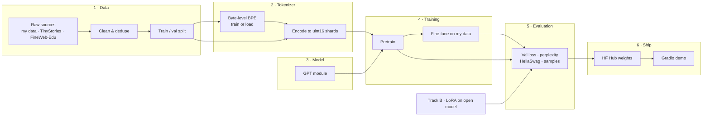
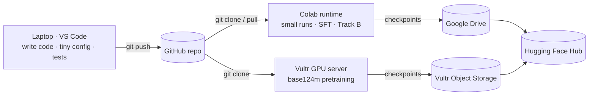

# Train Your Own GPT: System Design

Status: draft v1 · 2026-09-27

## 1. Goal

Build a GPT-style language model from scratch in PyTorch, train it, fine-tune it on custom data, and ship it as a public demo. Every core part (tokenizer, model, training loop, fine-tuning) is written by hand. Library code is used only for plumbing (downloading datasets, logging, the demo UI) and as a reference to test against.

**Success criteria**

1. A 124M-parameter model pretrained on at least 2.5B tokens, with a falling validation loss curve and coherent generated text.
2. The same model fine-tuned on custom data, with better validation loss on that data than the base model.
3. A measured comparison against a LoRA-tuned open model (Track B) on the same eval set.
4. A public GitHub repo with tests, a Hugging Face model card, and a Gradio demo anyone can try.
5. Total cloud spend within the $250 Vultr credit.

**Out of scope for v1:** RLHF/DPO, multi-node training, mixture-of-experts, quantization, serving at scale.

## 2. Constraints

| Constraint | Value | Design consequence |
|---|---|---|
| Local machine | Windows laptop, CPU only | All code must run on CPU with a tiny config for fast debugging. |
| Free GPU | Google Colab T4 (16 GB), sessions of at most 12h | Training must checkpoint often and resume exactly. |
| Paid GPU | Vultr, $250 credit | One script for all environments; budget guard that stops the run automatically. |
| Editor | VS Code + Google Colab extension | Colab runtime does not see local files; code reaches Colab through Git. |

## 3. Architecture overview



Every stage reads files from the previous stage and writes files for the next. No stage calls another stage's internals. This keeps each stage testable alone and lets different stages run on different machines.

## 4. Repository layout

```
Train-Your-Own-GPT/
├── pyproject.toml            # package "tygpt", pip install -e .
├── configs/                  # YAML configs, one per experiment
│   ├── tiny_cpu.yaml         # ~2M params, laptop debugging
│   ├── small_tinystories.yaml# ~14M params, Colab
│   ├── base124m_fineweb.yaml # 124M params, Vultr
│   └── sft_mydata.yaml       # fine-tuning run
├── src/tygpt/
│   ├── config.py             # typed config dataclasses + YAML loading
│   ├── data/
│   │   ├── sources.py        # adapters: text files, JSONL, HF datasets
│   │   ├── clean.py          # normalisation, filtering, exact dedupe
│   │   └── prepare.py        # CLI: raw → cleaned → tokenized shards
│   ├── tokenizer/
│   │   ├── bpe.py            # byte-level BPE (train, encode, decode, save, load)
│   │   └── backends.py       # common interface: ScratchBPE | TiktokenGPT2
│   ├── model/
│   │   ├── gpt.py            # GPT, Block, CausalSelfAttention, MLP
│   │   └── generate.py       # sampling: temperature, top-k, top-p
│   ├── train/
│   │   ├── loader.py         # memmap token loader, SFT batch loader
│   │   ├── trainer.py        # training loop
│   │   ├── checkpoint.py     # save / resume
│   │   └── logging.py        # stdout, CSV, optional W&B
│   ├── eval/
│   │   ├── perplexity.py
│   │   ├── hellaswag.py
│   │   └── compare.py        # side-by-side report: scratch vs Track B
│   └── cli.py                # tygpt prepare | train | sample | eval
├── track_b/                  # LoRA fine-tune of an open model (HF + PEFT/Unsloth)
├── notebooks/
│   └── colab_runner.ipynb    # clone repo, install, run a config
├── scripts/                  # vultr_setup.sh, vultr_teardown.md checklist
├── demo/app.py               # Gradio app
├── tests/                    # pytest, runs on CPU
└── docs/
    ├── system-design.md      # this file
    └── results.md            # loss curves, tables, cost report
```

## 5. Components

Each component lists its job, its inputs and outputs, and the decisions that shape it.

### 5.1 Config

- **Job:** one typed source of truth for every run. No hard-coded hyperparameters anywhere else.
- **Shape:** Python dataclasses (`DataConfig`, `TokenizerConfig`, `ModelConfig`, `TrainConfig`, `PathsConfig`) loaded from YAML. Any field can be overridden on the command line: `tygpt train configs/small.yaml train.lr=3e-4`.
- **Why:** the same config file is saved inside every checkpoint, so any result can be reproduced exactly.

### 5.2 Data pipeline

- **Job:** turn raw sources into clean, split text.
- **Input:** a source spec in config, such as `type: text_dir`, `type: jsonl`, or `type: hf_dataset`.
- **Output:** `data/processed/<name>/{train,val}.jsonl` (one document per line, so documents may contain newlines) plus `data_card.json` (document counts, bytes, filters applied, source hashes).
- **Steps:**
  1. **Load** through a source adapter. Each adapter yields plain documents. This is where your own data plugs in.
  2. **Clean:** Unicode NFC normalisation, strip control characters, drop documents that are too short or mostly non-text.
  3. **Deduplicate:** exact dedupe by SHA-256 of normalised text. Near-duplicate detection (MinHash) is deferred until real data shows a need.
  4. **Split** by document, not by line, with a fixed seed. Default is 99/1, and at least 1,000 val documents when available.
- **Big datasets:** FineWeb-Edu is streamed from Hugging Face and never fully held in memory.

### 5.3 Tokenizer

- **Job:** convert text to token IDs and back.
- **Interface** (both backends implement it):
  ```python
  class Tokenizer(Protocol):
      vocab_size: int
      def encode(self, text: str) -> list[int]: ...
      def decode(self, ids: list[int]) -> str: ...
      special_tokens: dict[str, int]   # <|endoftext|>, <|user|>, <|assistant|>, <|end|>
  ```
- **Backends:**
  - `ScratchBPE`: byte-level BPE written from scratch, with GPT-2-style regex pre-splitting. Trained on a sample of up to about 100 MB. Used for TinyStories and custom-data experiments. Default vocabulary is 8,192.
  - `TiktokenGPT2`: the GPT-2 vocabulary (50,257 tokens) through `tiktoken`. Used for the 124M FineWeb run, because encoding billions of tokens with a pure-Python encoder is too slow.
- **Proof that the scratch version is correct:** load GPT-2's published merges into `ScratchBPE` and check that its output matches `tiktoken` exactly on a test corpus. This test also shows interviewers that the scratch implementation is right, not just written.
- **Encoded format:** flat `uint16` NumPy arrays (`train.bin`, `val.bin`), with documents separated by `<|endoftext|>`. A sidecar `meta.json` records the tokenizer name, vocab size and token count. `uint16` works because both vocabularies are under 65,536.

### 5.4 Model

- **Job:** a decoder-only transformer, GPT-2 architecture.
- **Structure:** token embedding + learned position embedding → N × Block (pre-LayerNorm → causal multi-head self-attention → residual → pre-LayerNorm → MLP 4× with GELU → residual) → final LayerNorm → LM head with weights tied to the token embedding.
- **Attention:** uses `torch.nn.functional.scaled_dot_product_attention(is_causal=True)`, which picks flash attention on supported GPUs. A manual implementation is kept too, and a test checks that both give the same output.
- **Initialisation:** normal(0, 0.02), with residual projections scaled by 1/√(2·n_layer) as in GPT-2.
- **Presets:**

| Preset | Layers | Heads | d_model | Context | Vocab | ~Params | Runs on |
|---|---|---|---|---|---|---|---|
| `tiny` | 4 | 4 | 128 | 256 | 8,192 | 2M | Laptop CPU |
| `small` | 6 | 6 | 384 | 512 | 8,192 | 14M | Colab T4 |
| `base124m` | 12 | 12 | 768 | 1,024 | 50,304* | 124M | Vultr A100/H100 |

\*50,257 padded to a multiple of 64 for GPU efficiency.

### 5.5 Training

- **Job:** one trainer for pretraining and fine-tuning, on any device.
- **Loop features:**
  - AdamW (β = 0.9, 0.95; weight decay 0.1 on 2-D weights only)
  - Linear warmup then cosine decay to 10% of the peak learning rate
  - Gradient clipping at 1.0
  - Gradient accumulation, so the effective batch size doesn't depend on GPU memory
  - Mixed precision: bf16 on A100/H100, fp16 with GradScaler on T4, fp32 on CPU
  - `torch.compile` on when the environment supports it
  - Evaluation every `eval_interval` steps on a fixed val subset
- **Device selection:** automatic (`cuda` → `mps` → `cpu`), with the precision chosen to match.
- **Scale:** single GPU for v1. Multi-GPU DDP is a later extension. The trainer is written so it can be added without restructuring.

### 5.6 Checkpointing and resume

- **Saved every `ckpt_interval` steps and on exit:** model weights, optimizer state, GradScaler state, step, config, RNG states, data-loader position, and the best val loss so far.
- **Two files are kept:** `last.pt`, which is overwritten, and `best.pt`, the lowest val loss. Writes are atomic (write to a temporary file, then rename), so a disconnect mid-write can't corrupt a checkpoint.
- **Resume:** `tygpt train <config> --resume` continues from `last.pt`. A test checks that "train 20 steps" and "train 10 steps, stop, resume, train 10 more" produce the same weights.

### 5.7 Fine-tuning (SFT)

The fine-tuning mode depends on your data type:

| Data type | Mode | How it works |
|---|---|---|
| Documents / plain text | **Continued pretraining** | Same loss as pretraining on the new text, with a lower learning rate. |
| Conversations / Q&A | **Supervised fine-tuning** | JSONL `{"messages":[{"role","content"},...]}` rendered with special tokens. Loss is computed only on assistant tokens (a mask sets user-token targets to -100). |

In both modes, training starts from the pretrained checkpoint, uses a learning rate about 10× lower, and runs a few epochs with early stopping on custom-data val loss, so the model doesn't just memorise the data.

### 5.8 Generation

- `generate(model, prompt_ids, max_new_tokens, temperature, top_k, top_p)`, stopping at `<|end|>` or `<|endoftext|>`.
- v1 recomputes the full context at every step. A KV cache is a later optimisation, and a test will check it gives the same output as the no-cache version.

### 5.9 Evaluation

| Metric | Applies to | Purpose |
|---|---|---|
| Val loss / perplexity | All runs | Main training signal |
| Fixed-prompt samples | All runs | Qualitative check, saved at every eval |
| HellaSwag accuracy | `base124m` | Standard benchmark. The GPT-2 124M reference is ~29.5% |
| Bits per byte | All runs | Loss normalised by bytes, so models with different tokenizers can be compared |
| Custom-data bits per byte | Scratch SFT vs Track B | The head-to-head comparison |

`compare.py` writes `docs/results.md` with tables and loss-curve PNGs.

### 5.10 Track B (LoRA baseline)

- Lives in `track_b/` and deliberately uses libraries: Hugging Face `transformers`, `peft` or Unsloth, and a 1B–3B open model (Qwen, Llama or Gemma).
- It uses the **same processed dataset and the same val split** as the scratch model (section 5.2), so the comparison is fair.
- It runs on Colab with QLoRA.

### 5.11 Demo

- `demo/app.py`: a Gradio chat or completion UI that loads weights from the Hugging Face Hub. It runs on a free HF Spaces CPU instance, where a 124M model is fast enough.
- Model card: architecture, data, training compute and cost, eval results, limitations.

## 6. Environments and workflow

The same code and configs run everywhere. Only `paths.*` and the device change.



| Environment | How code arrives | Data & checkpoint location | Used for |
|---|---|---|---|
| Laptop | Local working copy | `./data`, `./checkpoints` | Coding, unit tests, `tiny` config |
| Colab (from VS Code) | `colab_runner.ipynb` runs `git clone` + `pip install -e .` | `/content/drive/MyDrive/tygpt/` | `small` runs, SFT, Track B |
| Vultr | `git clone` + setup script | Local NVMe, synced to object storage every checkpoint | `base124m` pretraining |

**Important:** the VS Code Colab extension runs notebook cells on Colab, but the Colab machine does **not** see files on your laptop. Code gets there through GitHub, and data gets there through Drive or a Hugging Face download.

## 7. Failure handling

| Failure | Detection | Response |
|---|---|---|
| Colab disconnect / timeout | Session ends | Resume from `last.pt` on Drive. At most `ckpt_interval` steps are lost. |
| Loss becomes NaN/Inf | Checked every step | Save a debug checkpoint, log the last batch index, stop with a clear error. |
| Loss spike | Loss > 3× running average | Log a warning. Stop if it persists for more than N evals. |
| CUDA out of memory | Exception on first steps | Error message suggests halving `micro_batch_size`; accumulation keeps the effective batch the same. |
| Vultr overspend | `train.max_hours` and `train.max_cost_usd` in config | Trainer saves and exits cleanly when either limit is reached. |
| Forgetting to destroy the Vultr instance | Human process | `scripts/vultr_teardown.md` checklist: sync checkpoints → verify → destroy. |
| Corrupt checkpoint | Atomic write (temp file + rename) | The previous checkpoint is always valid. |

## 8. Testing strategy

All tests run on CPU in under about 2 minutes, locally and in GitHub Actions on every push.

| Area | Tests |
|---|---|
| Tokenizer | encode→decode round trip on random Unicode; ScratchBPE with GPT-2 merges matches tiktoken exactly; special tokens never split |
| Data | dedupe removes exact duplicates; split has no document in both train and val; `uint16` shards round-trip |
| Model | output shapes; parameter count matches preset; **causality** (changing token t+1 never changes logits at ≤ t); SDPA and manual attention agree |
| Training | overfits a single batch to near-zero loss; save → resume gives the same weights as uninterrupted training; SFT mask gives zero loss contribution from user tokens |
| Generation | deterministic with fixed seed; stops at end token |

## 9. Compute and budget plan

Training compute is estimated as FLOPs ≈ 6 × parameters × tokens.

| Run | Params | Tokens | FLOPs | Hardware | Est. time | Est. cost |
|---|---|---|---|---|---|---|
| `tiny` debug | 2M | 5M | 6e13 | Laptop | minutes | $0 |
| `small` TinyStories | 14M | ~470M | 4e16 | Colab T4 | 1–3 h | $0 |
| `base124m` FineWeb-Edu | 124M | 2.5B | 1.9e18 | 1× A100 80GB | ~4–6 h | ~$10–25 |
| `base124m` extended | 124M | 10B | 7.4e18 | 1× A100/H100 | ~12–20 h | ~$30–60 |

Estimates assume about 35–40% of peak GPU throughput. **Before the real run, a 15-minute benchmark on the rented GPU measures actual tokens/sec**, and the final token budget is set from that number, not from this table.

**Budget allocation ($250):** benchmark and setup ~$15 · main 124M run ~$25 · extended or 350M stretch run ≤ $100 · reserve for reruns ≥ $100.

## 10. Build order

Each step is its own small project with its own plan, tests and PR. Each produces something runnable. The detailed procedure for every step is in section 13.

| # | Sub-project | Done when | Runs on |
|---|---|---|---|
| 0 | Scaffold: package, config, CLI, CI | `pytest` passes in GitHub Actions | Laptop |
| 1 | Data pipeline | TinyStories + custom data → split text with data card | Laptop |
| 2 | Tokenizer | ScratchBPE matches tiktoken; shards written | Laptop |
| 3 | Model + generation | All model tests pass; `tiny` overfits a batch | Laptop |
| 4 | Trainer + checkpointing | `tiny` trains end-to-end on CPU; resume test passes | Laptop |
| 5 | Colab runner | `small` trains on TinyStories, survives a forced disconnect | Colab |
| 6 | Evaluation | Perplexity, samples, HellaSwag working | Colab |
| 7 | Big run | `base124m` trained within budget; results logged | Vultr |
| 8 | Fine-tuning | Custom-data val loss improves over base | Colab |
| 9 | Track B + comparison | `results.md` with head-to-head table | Colab |
| 10 | Ship | HF Hub weights, Gradio Space live, README with results | HF |

## 11. Dependencies

| Package | Why | Where |
|---|---|---|
| `torch` | Model and training | Core |
| `numpy` | Token shards (memmap) | Core |
| `pyyaml` | Configs | Core |
| `tqdm` | Progress bars | Core |
| `datasets` | Stream TinyStories / FineWeb-Edu | Data |
| `tiktoken` | GPT-2 tokenizer backend + reference for tests | Tokenizer |
| `regex` | GPT-2 Unicode-aware pre-split pattern | Tokenizer |
| `pytest` | Tests | Dev |
| `wandb` (optional) | Loss dashboards | Training |
| `transformers`, `peft` / `unsloth` | Track B only | `track_b/` |
| `gradio`, `huggingface_hub` | Demo and publishing | `demo/` |

## 12. Open decisions

| Decision | Options | Blocks |
|---|---|---|
| **Custom data type** | Documents · conversations/Q&A · code · undecided | Step 1 source adapter, step 8 fine-tuning mode (section 5.7) |
| Custom data size | MB · hundreds of MB · GB | Whether ScratchBPE is retrained on it, and the number of SFT epochs |
| Experiment tracking | W&B (free tier) · CSV + matplotlib only | Step 4 logging |

## 13. Step-by-step build procedure

This section expands the build order in section 10 into a concrete procedure. Steps must be done in order, because each one uses the outputs of the one before it.

### 13.0 How every step is built

Every step follows the same loop:

1. **Branch:** `git switch -c step-N-<name>` from an up-to-date `main`.
2. **Plan:** write `docs/superpowers/plans/<date>-stepN-<name>.md` with bite-sized tasks, exact files, and test code.
3. **Build test-first:** for each task, write the failing test → run it and watch it fail → write the code → watch it pass → commit.
4. **Verify:** run the full test suite and the step's "Verify" commands below. Paste real output, not assumptions.
5. **Pull request:** push the branch, open a PR, wait for CI to pass, then merge into `main`.
6. **Record:** add any numbers the step produced (loss, tokens/sec, cost) to `docs/results.md`. Tag the release `v0.N`.

Nothing moves to the next step until the current step's **Done when** line is true.

---

### Step 0: Scaffold

- **Goal:** an installable package with configs, a CLI and CI, so every later step has a home.
- **Runs on:** laptop.
- **Plan:** `docs/superpowers/plans/2026-09-27-step0-scaffold.md` (already written).
- **Build, in order:**
  1. Create `.venv` and `pyproject.toml`; install with `pip install -e ".[dev]"`.
  2. `src/tygpt/config.py`: dataclasses per section, type coercion, validation (section 5.1).
  3. YAML loading and `section.key=value` overrides; add `configs/tiny_cpu.yaml`.
  4. `src/tygpt/cli.py` with the `tygpt config` command.
  5. `.github/workflows/ci.yml` running pytest on Python 3.10 and 3.13 with CPU-only torch.
- **Verify:**
  ```powershell
  .venv\Scripts\python -m pytest
  .venv\Scripts\tygpt config configs\tiny_cpu.yaml train.lr=5e-4
  ```
- **Done when:** all tests pass locally and the CI run on GitHub is green.
- **You'll learn:** Python packaging, typed configs, test-driven development, CI.

---

### Step 1: Data pipeline

- **Goal:** turn any raw source into clean, deduplicated, split documents.
- **Runs on:** laptop.
- **Needs from earlier:** `Config.data` (step 0).
- **Build, in order:**
  1. Add config fields `data.text_field` (default `text`), `data.min_chars` (default 200) and `data.max_docs` (optional, for quick runs).
  2. `data/sources.py`: one adapter per source type, all exposing `iter_documents(cfg) -> Iterator[str]`:
     - `text_dir`: every `.txt` / `.md` file under a folder is one document.
     - `jsonl`: one JSON object per line; reads `text_field`, or `messages` for chat data.
     - `hf_dataset`: streams a Hugging Face dataset, so it never loads everything into memory.
  3. `data/clean.py`: `normalize(text)` (Unicode NFC, strip control characters, collapse runs of blank lines), `keep(text, min_chars)`, and exact dedupe by SHA-256.
  4. Deterministic split: a document goes to val when `hash(seed + text)` falls under `val_fraction`. This works while streaming and never puts the same document in both splits.
  5. `data/prepare.py` + `tygpt prepare <config>`: writes `data/processed/<name>/train.jsonl`, `val.jsonl` (one `{"text": ...}` per line, so documents can safely contain newlines) and `data_card.json` (counts, bytes, duplicates removed, filters used).
- **Verify:**
  ```powershell
  .venv\Scripts\tygpt prepare configs\tiny_cpu.yaml data.max_docs=20000
  Get-Content data\processed\tinystories\data_card.json
  ```
- **Tests:** normalisation cases; duplicates removed; no document in both splits; split is identical across two runs with the same seed; each adapter reads a small fixture.
- **Done when:** TinyStories (and a sample of your own data once its type is decided) produce split JSONL with a data card.
- **You'll learn:** why data quality matters more than model tweaks, and why splitting by document prevents train/val leakage.

---

### Step 2: Tokenizer

- **Goal:** a byte-level BPE tokenizer written from scratch and proven correct, plus encoded token shards.
- **Runs on:** laptop.
- **Needs from earlier:** `train.jsonl` / `val.jsonl` (step 1).
- **Build, in order:**
  1. Add the `regex` package (needed for GPT-2's Unicode-aware pre-split pattern).
  2. `tokenizer/bpe.py` training: split text with the GPT-2 regex → work in UTF-8 bytes (IDs 0–255) → repeatedly count adjacent pairs and merge the most frequent into a new ID until `vocab_size` is reached.
  3. `encode()`: apply learned merges in order of rank. `decode()`: map IDs back to bytes, then UTF-8 with `errors="replace"`.
  4. Special tokens (`<|endoftext|>`, `<|user|>`, `<|assistant|>`, `<|end|>`) that are never split.
  5. `save()` / `load()` to `tokenizer.json`.
  6. `tokenizer/backends.py`: `get_tokenizer(cfg)` returns `ScratchBPE` or `TiktokenGPT2` behind the same interface (section 5.3).
  7. **Correctness proof:** rebuild GPT-2's merges from tiktoken's rank table, load them into `ScratchBPE`, and check that its output matches tiktoken exactly on a test corpus.
  8. `tygpt tokenize <config>`: encodes the JSONL into `train.bin` / `val.bin` (`uint16`, documents separated by `<|endoftext|>`) plus `meta.json`, using multiple processes.
- **Verify:**
  ```powershell
  .venv\Scripts\tygpt tokenize configs\tiny_cpu.yaml
  .venv\Scripts\python -c "import numpy as np; a=np.memmap('data/processed/tinystories/train.bin',dtype=np.uint16); print(len(a), a[:20])"
  ```
- **Tests:** encode→decode round trip on random Unicode; GPT-2 equivalence; special tokens stay whole; shard length matches the token count in `meta.json`.
- **Done when:** the GPT-2 equivalence test passes and token shards exist for TinyStories.
- **You'll learn:** how BPE works, why byte-level tokenizers never hit "unknown" characters, and compression ratio (bytes per token).

---

### Step 3: Model and generation

- **Goal:** the GPT module and text generation, verified by tests before any real training.
- **Runs on:** laptop.
- **Needs from earlier:** `ModelConfig` (step 0).
- **Build, in order:**
  1. `model/gpt.py`, bottom up: `CausalSelfAttention` (manual version with an explicit causal mask) → `MLP` → `Block` (pre-LayerNorm + residuals) → `GPT` (embeddings, blocks, final LayerNorm, tied LM head).
  2. `GPT.forward(idx, targets=None) -> (logits, loss)`, with cross-entropy loss when targets are given.
  3. GPT-2 weight initialisation and `num_params()`.
  4. Add the fast path `F.scaled_dot_product_attention(is_causal=True)`, and keep the manual version for testing.
  5. `model/generate.py`: temperature, top-k and top-p sampling, stopping at an end token.
  6. Optional but valuable: a loader that copies Hugging Face's pretrained GPT-2 weights into our module. If our model then produces the same logits as Hugging Face's, the architecture is proven correct.
- **Verify:**
  ```powershell
  .venv\Scripts\python -m pytest tests\model -v
  ```
- **Tests:** output shapes; parameter counts per preset (`base124m` ≈ 124M); **causality** (changing a future token never changes earlier logits); SDPA and manual attention agree; the `tiny` model overfits a single batch to near-zero loss; generation is reproducible with a fixed seed.
- **Done when:** all model tests pass and a single batch overfits on CPU.
- **You'll learn:** self-attention, causal masking, residual streams, why scale by √d<sub>k</sub>, weight tying.

---

### Step 4: Trainer and checkpointing

- **Goal:** one training loop that works on CPU, Colab and Vultr, and can stop and resume exactly.
- **Runs on:** laptop.
- **Needs from earlier:** token shards (step 2), `GPT` (step 3).
- **Build, in order:**
  1. `train/loader.py`: `TokenLoader` reads random windows of `block_size + 1` tokens from the `uint16` memmap and returns `(x, y)`. Its RNG state is saveable.
  2. Learning-rate schedule `get_lr(step)`: linear warmup, then cosine decay to `min_lr_ratio × lr`.
  3. AdamW with two parameter groups: weight decay on 2-D weights only.
  4. `resolve_device(cfg)`: picks `cuda` → `mps` → `cpu`, and picks precision by GPU generation: **bf16 only on compute capability ≥ 8.0 (A100/H100); fp16 with GradScaler on the T4**, even though the T4 reports emulated bf16 support.
  5. `train/trainer.py`: gradient accumulation, clipping, autocast, optional `torch.compile`, eval every `eval_interval` steps, sample generation at each eval.
  6. `train/logging.py`: stdout + `metrics.csv` (step, loss, val loss, lr, tokens/sec), optional W&B.
  7. `train/checkpoint.py`: atomic save of the full state (section 5.6); `--resume` loads `last.pt`.
  8. Guards: stop on NaN/Inf; stop cleanly at `max_hours` or `max_cost_usd`.
  9. CLI: `tygpt train <config> [--resume]` and `tygpt sample <checkpoint> --prompt "..."`.
- **Verify:**
  ```powershell
  .venv\Scripts\tygpt train configs\tiny_cpu.yaml
  # stop it with Ctrl+C partway, then:
  .venv\Scripts\tygpt train configs\tiny_cpu.yaml --resume
  .venv\Scripts\tygpt sample checkpoints\tiny_cpu\best.pt --prompt "Once upon a time"
  ```
- **Tests:** learning-rate schedule values at key steps; weight decay groups; save→resume gives identical weights to an uninterrupted run; NaN guard triggers; cost guard stops at the limit.
- **Done when:** `tiny` trains end to end on CPU with a falling loss, and the resume test passes.
- **You'll learn:** AdamW, warmup and cosine schedules, mixed precision, gradient accumulation, reproducibility.

---

### Step 5: Colab runner

- **Goal:** run real training on the free T4, safe against disconnects.
- **Runs on:** Colab, driven from VS Code.
- **Needs from earlier:** everything from steps 0–4, pushed to GitHub.
- **Build, in order:**
  1. `configs/small_tinystories.yaml`: the ~14M `small` preset, fp16, checkpoints to Drive.
  2. `notebooks/colab_runner.ipynb`: mount Google Drive → `git clone` (or `git pull`) → `pip install -e .` → `tygpt prepare` and `tygpt tokenize` (skipped if shards already exist on Drive) → `tygpt train --resume`.
  3. Log tokens/sec and GPU memory use to find the largest `micro_batch_size` that fits.
  4. **Disconnect drill:** restart the runtime mid-training, re-run the notebook, and confirm it continues from the last checkpoint.
- **Verify:** the loss curve in `metrics.csv` continues smoothly across the restart; samples read as simple, coherent stories.
- **Done when:** `small` finishes training on TinyStories and survives a forced disconnect.
- **You'll learn:** GPU throughput, memory limits, and working with unreliable compute.

---

### Step 6: Evaluation

- **Goal:** measure models with numbers, not just by reading samples.
- **Runs on:** Colab.
- **Needs from earlier:** checkpoints (steps 4–5).
- **Build, in order:**
  1. `eval/perplexity.py`: val loss and perplexity over the full val shard, plus **bits per byte** (loss normalised by UTF-8 bytes). Bits per byte is what makes models with different tokenizers comparable in step 9.
  2. Fixed-prompt samples saved at every eval.
  3. `eval/hellaswag.py`: for each question, score all four endings by average token loss and pick the lowest. If step 3's GPT-2 loader exists, check the scorer gives ≈ 29% on pretrained GPT-2 weights.
  4. `eval/plots.py`: `metrics.csv` → loss-curve PNGs.
  5. `tygpt eval <checkpoint>` writes results to `docs/results.md`.
- **Done when:** perplexity, bits per byte, samples and HellaSwag run on the `small` model.
- **You'll learn:** what perplexity means, why benchmarks need careful scoring, why comparisons across tokenizers need normalising.

---

### Step 7: The big run on Vultr

- **Goal:** pretrain the 124M model on FineWeb-Edu within budget.
- **Runs on:** Vultr A100 or H100.
- **Needs from earlier:** steps 0–6 working on Colab.
- **Build, in order:**
  1. `configs/base124m_fineweb.yaml`: `tiktoken_gpt2` backend, bf16, `compile: true`, `max_hours` and `max_cost_usd` set.
  2. Extend `TokenLoader` to read multiple shards (~100M tokens each), because billions of tokens don't fit one file.
  3. `scripts/vultr_setup.sh`: install drivers check, clone repo, create venv, install, log in to W&B, configure object-storage sync.
  4. Tokenize FineWeb-Edu on the server using all CPU cores (the GPU sits idle here, so do this on a cheaper CPU instance if the time is long).
  5. **Benchmark:** 15-minute run → measured tokens/sec → set `max_steps` to fit the token budget and the $ cap.
  6. Launch inside `tmux` so the run survives SSH disconnects; sync checkpoints to object storage every checkpoint.
  7. After the run: sync final checkpoints → verify they load → **destroy the instance** (`scripts/vultr_teardown.md`).
- **Done when:** the model is trained, HellaSwag is measured, and `docs/results.md` has the loss curve and a cost report (GPU type, hours, $, tokens/sec).
- **You'll learn:** scaling laws in practice, GPU efficiency (MFU), running long jobs on rented hardware.

---

### Step 8: Fine-tuning on your data

- **Goal:** adapt the 124M model to your own data.
- **Runs on:** Colab.
- **Needs from earlier:** `base124m` checkpoint (step 7); your data prepared by step 1. **The custom data type must be decided before this step** (section 12).
- **Build, in order:**
  1. Config field `train.init_from`: start from a checkpoint instead of random weights.
  2. Mode by data type (section 5.7):
     - documents → continued pretraining on your tokenized data;
     - conversations → `train/sft_loader.py`, which renders messages with special tokens and masks loss to assistant tokens only.
  3. `configs/sft_mydata.yaml`: learning rate ~10× lower, a few epochs, early stopping on custom val loss.
- **Done when:** val loss on your data is lower than the base model's, and samples show the model picked up your data's content or style.
- **You'll learn:** transfer learning, loss masking, overfitting on small datasets.

---

### Step 9: Track B and comparison

- **Goal:** compare your scratch model against the industry-standard approach.
- **Runs on:** Colab.
- **Needs from earlier:** the same split data (step 1), evaluation (step 6), your fine-tuned model (step 8).
- **Build, in order:**
  1. `track_b/finetune_lora.py` (or notebook): QLoRA fine-tune of a 1B–3B open model with Unsloth on the **same** train split.
  2. Evaluate both models on the **same** val split, comparing **bits per byte** (not raw loss, since the tokenizers differ), plus side-by-side answers to fixed prompts.
  3. `eval/compare.py` writes the head-to-head table into `docs/results.md`.
- **Done when:** `docs/results.md` has the comparison table, and you can explain why the numbers came out the way they did.
- **You'll learn:** LoRA, when to train from scratch versus fine-tune, fair evaluation.

---

### Step 10: Ship

- **Goal:** something a recruiter can click on and try.
- **Runs on:** Hugging Face.
- **Build, in order:**
  1. Export weights as `safetensors` with `config.json` and `tokenizer.json`; push to the Hugging Face Hub with a model card (architecture, data, compute, cost, results, limitations).
  2. `demo/app.py`: Gradio UI that installs `tygpt` from GitHub and loads the weights from the Hub; deploy to a free HF Space.
  3. README: what it is, results table, loss curves, demo link, how to reproduce.
  4. Write-up (blog post or `docs/writeup.md`): decisions, what went wrong, what you learned.
- **Done when:** the demo is live, the repo README shows real results, and every number on the recruiter pitch is filled in.
